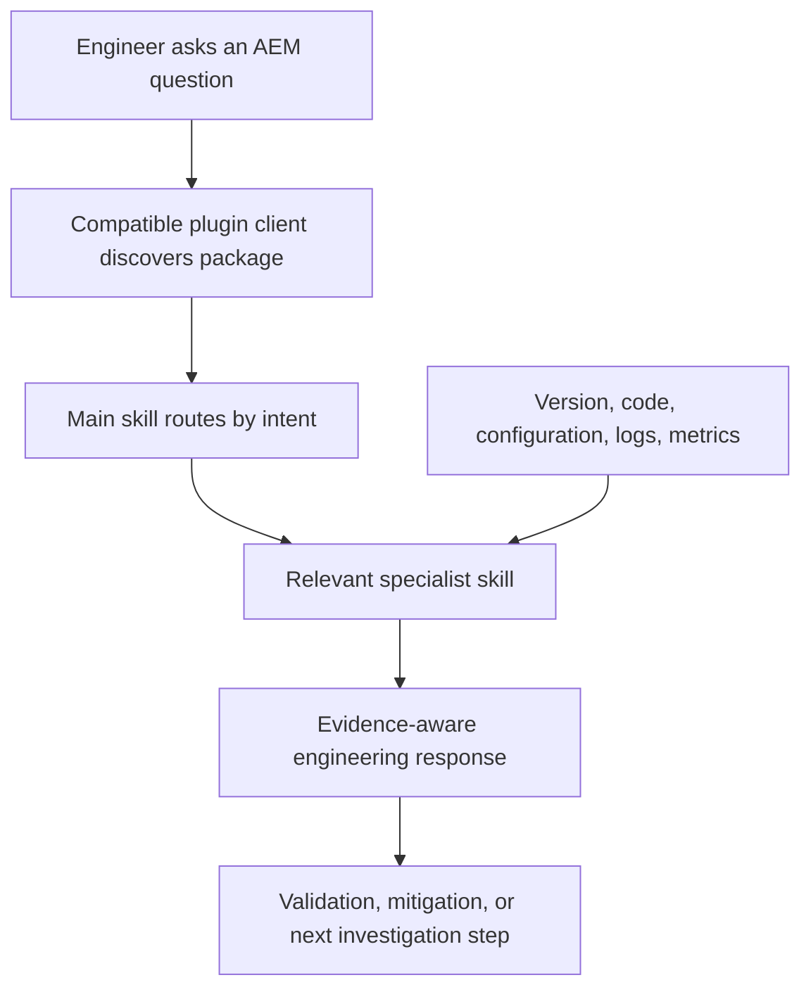

# AEM Architect Engineering Copilot

   

**A reusable, production-focused engineering copilot for experienced Adobe Experience Manager and Java engineers.**

> Public repository URL: **`https://github.com/srma4tech/aem-architect-engineering-copilot`** — replace this placeholder after the repository is published.

## Table of contents

- [What this project is](#what-this-project-is)
- [Why it exists](#why-it-exists)
- [Who it is for](#who-it-is-for)
- [Core capabilities](#core-capabilities)
- [Skills](#skills)
- [How it works](#how-it-works)
- [Quick start](#quick-start)
- [Installation](#installation)
- [Example prompts](#example-prompts)
- [Engineering principles](#engineering-principles)
- [AEM 6.5 and AEM as a Cloud Service](#aem-65-and-aem-as-a-cloud-service)
- [Supported engineering areas](#supported-engineering-areas)
- [Repository structure](#repository-structure)
- [Development and validation](#development-and-validation)
- [Contributing](#contributing)
- [Versioning and changelog](#versioning-and-changelog)
- [Project status and limitations](#project-status-and-limitations)
- [License](#license)

## What this project is

AEM Architect Engineering Copilot is an [Agent Plugin](https://agent-plugins.org/specification) that packages ten focused [Agent Skills](https://agentskills.io/specification). The skills guide an AI assistant through AEM architecture, implementation, review, operations, migration, and interview preparation.

The plugin provides instructions, not an AEM integration. It does not connect to an AEM environment, inspect a repository by itself, or run Adobe tools. The host must provide relevant files, context, and capabilities for the assistant to use them.

## Why it exists

AEM engineering decisions cross application code, repository behavior, caching, deployment topology, and operations. This project gives those discussions a consistent, production-oriented frame while keeping specialized workflows concise and discoverable.

It aims to help engineers reason from evidence, make trade-offs explicit, distinguish platform behavior from assumptions, and identify the validation or recovery work a design needs.

## Who it is for

- Experienced AEM developers and Java backend engineers
- Engineers reviewing AEM code, pull requests, or architecture proposals
- Technical Leads and Solution Architects working with AEM systems
- Engineers assessing AEM 6.5 solutions for AEM as a Cloud Service
- Candidates preparing for senior AEM engineering and architecture interviews

The material assumes practical engineering experience. It does not aim to replace Adobe product documentation, environment-specific runbooks, or hands-on validation.

## Core capabilities

- Design and evaluate AEM systems, integrations, and architecture decisions
- Implement and review Java, Sling, OSGi, and JCR/Oak code
- Investigate production behavior, performance bottlenecks, and security exposure
- Assess cloud readiness and plan AEM 6.5 to AEM as a Cloud Service migration
- Reason about Dispatcher/CDN caching, assets, MSM, headless delivery, and asynchronous processing
- Prepare for Technical Lead and Solution Architect discussions

## Skills

Each skill has its own `SKILL.md` under `skills/`. The main skill provides shared principles and intent routing; the specialist skills cover focused workflows.

| Skill | Capability |
| --- | --- |
| `aem-architect-engineering-copilot` | Routes requests and applies shared evidence, versioning, and response-quality rules. |
| `aem-architecture` | AEM system design, platform boundaries, trade-offs, and ADRs. |
| `aem-implementation` | Java/AEM implementation across Sling, OSGi, Oak, assets, MSM, GraphQL, workflows, and integrations. |
| `aem-code-review` | Code and pull request review focused on correctness and production risks. |
| `aem-troubleshooting` | Evidence-led incident diagnosis, mitigation, recovery, and prevention. |
| `aem-performance` | Measurement-driven latency, throughput, capacity, repository, and cache investigations. |
| `aem-security` | Threat boundaries, permissions, application risks, and security validation. |
| `aem-cloud-readiness` | Evidence-based assessment of AEM 6.5 customizations for Cloud Service. |
| `aem-migration` | Migration sequencing, rehearsal, cutover, validation, and rollback planning. |
| `aem-interview` | Scenario-based practice for Senior Developer, Technical Lead, and Solution Architect roles. |

## How it works

An Agent Plugin-compatible client discovers `plugin.json` at the package root and skills in the fixed `skills/` location. The main skill describes how to select the relevant specialist guidance. The assistant uses that guidance with the evidence and tools available in the host.



The diagram describes the instruction flow, not a guarantee that every client loads or presents skills in the same way. Client behavior depends on its Agent Plugin and Agent Skills support.

## Quick start

1. Install the repository root in an Agent Plugin-compatible client.
2. State the AEM version and service tier when known.
3. Include the relevant code, configuration, logs, metrics, constraints, or desired outcome.
4. Ask for the work you need, such as a code review, incident investigation, or migration assessment.

For example: “Review an AEM 6.5 Sling service for resolver lifecycle, Oak query cost, permissions, and AEM as a Cloud Service compatibility.”

## Installation

This package targets Agent Plugins v1.0.0. Install it with a client that supports the [Agent Plugins specification](https://agent-plugins.org/specification) and Agent Skills. Client-specific installation steps vary; use the client’s documentation for local plugin directories or Git-based installation.

The install location is the repository root—the directory containing `plugin.json`—not an individual skill directory.

After this repository is hosted, clone it with the published URL:

```sh
git clone <PUBLIC_GITHUB_REPOSITORY_URL>
```

Replace the placeholder with the actual repository URL. No public URL is currently asserted here.

## Example prompts

### Architecture and ADRs

> Design an AEM content delivery architecture for these traffic, security, and availability requirements. Compare the viable AEM primitives and state assumptions, failure modes, and trade-offs.

### Implementation and code review

> Review this Sling service change for lifecycle ownership, concurrency, Oak access patterns, permissions, and test coverage. Flag only actionable findings.

### Production troubleshooting

> Publish latency increased after this deployment. Separate observed facts from hypotheses, identify the highest-value evidence to collect, and propose reversible containment steps.

### Performance

> Assess these response percentiles, cache headers, and Oak query plans. Identify bottleneck hypotheses and how to confirm or rule each one out.

### Security

> Review this servlet and its Dispatcher exposure. Evaluate authorization, input handling, service-user permissions, and cache behavior using the supplied configuration.

### Cloud readiness and migration

> Assess these AEM 6.5 customizations for Cloud Service readiness. Organize findings by evidence, impact, required change, and validation; call out unknowns.

### Assets, MSM, and headless delivery

> Review this asset-processing flow / MSM rollout / Content Fragment GraphQL endpoint for retries, permissions, repository impact, caching, and version-specific assumptions.

### Interview preparation

> Give me one Technical Lead scenario about AEM asynchronous processing. Ask one question at a time and evaluate my reasoning about retries, scaling, security, operations, and trade-offs.

## Engineering principles

- **Evidence before conclusions:** use code, configuration, logs, metrics, traces, query plans, cache headers, and reproducible behavior where available.
- **Clear uncertainty:** distinguish confirmed platform behavior, user-provided facts, inference, and recommendations when it affects the decision.
- **Version awareness:** verify version-sensitive behavior against authoritative Adobe documentation and the target environment.
- **Production-first reasoning:** consider failure modes, recovery, observability, deployment, performance, and operational ownership.
- **Security and least privilege:** evaluate trust boundaries, effective permissions, input handling, secrets, and private-response caching.
- **Explicit trade-offs:** explain why a design fits its constraints and when another option may be preferable.
- **Proportionate answers:** use only the structure and depth the request needs; do not turn every question into a full architecture review.

## AEM 6.5 and AEM as a Cloud Service

The copilot covers both AEM 6.5 and AEM as a Cloud Service (AEMaaCS). It treats them as related platforms with release-, topology-, and service-specific behavior—not as interchangeable environments.

For AEM 6.5, confirm the installed service pack, topology, and enabled capabilities. For AEMaaCS, verify current supported extension points, deployment and operational constraints, and service behavior. The skills avoid blanket compatibility claims; use current Adobe documentation and target-environment evidence for version-sensitive decisions.

## Supported engineering areas

| Area | Topics covered |
| --- | --- |
| Architecture | System boundaries, integration patterns, ADRs, trade-offs, reliability, and operations |
| Java and Sling | Resource APIs, ResourceResolver lifecycle, Sling Models, servlets, filters, and services |
| OSGi | Declarative Services, lifecycle, configuration, references, and deployment context |
| JCR and Oak | Repository access, query constraints, indexing, explain plans, and traversal risk |
| Delivery and caching | Dispatcher, CDN, cacheability, invalidation, authorization, and content freshness |
| Async processing | Workflows, Sling Events/Jobs, schedulers, idempotency, retries, and recovery |
| Assets and sites | DAM processing, renditions, MSM, Live Copies, inheritance, and rollout risk |
| Headless | Content Fragment Models, GraphQL, query cost, endpoint access, and caching |
| Security | Authentication, authorization, ACLs, service users, web risks, secrets, and exposure |
| Engineering operations | Testing, observability, production troubleshooting, Cloud readiness, migration, and interviews |

These are areas of advisory guidance, not bundled AEM components or integrations.

## Repository structure

```text
.
├── plugin.json
├── skills/
│   ├── aem-architect-engineering-copilot/SKILL.md
│   ├── aem-architecture/SKILL.md
│   ├── aem-cloud-readiness/SKILL.md
│   ├── aem-code-review/SKILL.md
│   ├── aem-implementation/SKILL.md
│   ├── aem-interview/SKILL.md
│   ├── aem-migration/SKILL.md
│   ├── aem-performance/SKILL.md
│   ├── aem-security/SKILL.md
│   └── aem-troubleshooting/SKILL.md
├── scripts/validate_plugin.py
├── requirements-dev.txt
├── .github/workflows/validate.yml
├── CONTRIBUTING.md
├── CHANGELOG.md
└── LICENSE
```

## Development and validation

Requirements: Python 3.10 or later. PyYAML is used only by the repository validator; the plugin itself has no runtime dependencies.

Install the development dependency and run validation from the repository root:

```sh
python -m pip install -r requirements-dev.txt
python scripts/validate_plugin.py
```

The GitHub Actions workflow runs the same structural validator for pushes and pull requests. The validator checks JSON and selected manifest constraints, skill directories and YAML frontmatter, skill-name consistency, local Markdown links, and common encoding issues in skill bodies. It does not implement the full Agent Plugins schema, render or lint all Markdown, or verify behavior in every plugin client.

When adding or changing a skill, update the skills matrix above and the changelog. Keep shared guidance in the main skill; keep specialist instructions specific and actionable. See [CONTRIBUTING.md](CONTRIBUTING.md) for review expectations.

## Contributing

Contributions should improve accuracy, portability, or practical value for AEM engineers. Use authoritative Adobe sources for version-sensitive behavior, identify uncertainty, and avoid duplicating shared instructions. Do not include credentials, personal tokens, customer information, or environment-specific configuration.

Before proposing a change, run the validator and review the complete diff. See [CONTRIBUTING.md](CONTRIBUTING.md) for contribution and validation guidance.

## Versioning and changelog

The plugin manifest version is **1.1.1**. User-visible changes are recorded in [CHANGELOG.md](CHANGELOG.md). The package follows semantic-versioning guidance for plugin versions; Agent Plugins format compatibility is declared separately by the `plugin.json` `$schema` value.

## Project status and limitations

- Current package version: **1.1.1**.
- Distribution format: Agent Plugin with ten instruction-based skills.
- Runtime: no bundled service, MCP server, Adobe credentials, or AEM environment connection.
- Repository URL: **[aem-architect-engineering-copilot](https://github.com/srma4tech/aem-architect-engineering-copilot.git)** placeholder; replace it after publication.
- Guidance depends on the evidence supplied and should be checked against the target AEM release, architecture, and operational policies.

This project is not a substitute for Adobe product documentation, security review, performance testing, or environment-specific operational procedures.

## License

This project is licensed under the MIT License. See [LICENSE](LICENSE).
